# 招聘助手 V1：产品全貌与三人分工（人类版）

> 3 分钟读懂｜版本 V1.0｜2026-08-21

## 1. 这是什么产品

招聘助手是给 HR 使用的简历筛选工作台。

它从飞书招聘读取新简历，用 AI 找出与岗位要求相关的事实和原文证据，再按固定规则计算匹配结果，最后交给 HR 人工复核。

一句话理解：

> AI 先帮 HR 阅读和整理简历，但最终判断仍由 HR 完成。

## 2. 项目有两条线

| 线路 | 做什么 | 当前性质 |
|---|---|---|
| 正式主链路 | 把飞书招聘中的简历变成 HR 可复核的筛选结果 | V1 必须交付 |
| BOSS 测试支线 | 测试 BOSS 简历能否自动获取、下载并进入飞书 | 只做可行性测试，不阻塞 V1 |

两条线只在飞书招聘汇合：无论简历来自官网、人工上传，还是未来可能实现的 BOSS 自动获取，招聘助手都只从飞书招聘读取数据。

## 3. 正式主链路：按照 1 → 7 执行

1. 候选人在招聘官网投递，或者 HR 把已有简历上传飞书招聘。
2. 飞书招聘保存职位、人才、投递和简历附件，是唯一人才档案源。
3. 招聘助手通过飞书 API 只读获取新投递和简历。
4. 系统解析简历、识别重复简历。
5. 项目负责人根据 JD 画像，用 AI 提取事实、原文证据和缺失信息。
6. 自动化筛选评估按照固定规则计算分数和推荐等级。
7. HR 在新源建设的工作台中核对原文，确认或纠错。

### HR 最终能看到什么

- 今日有哪些候选人需要复核；
- 候选人匹配哪些岗位要求；
- 每个判断对应哪段简历原文；
- 哪些信息缺失或互相冲突；
- AI 给出的建议以及固定规则计算的结果。

## 4. BOSS 测试支线：只回答“能不能做”

BOSS 负责人当前不交付正式生产功能，只做一轮有时间限制的可行性测试：

1. 使用授权测试账号验证登录和会话保持；
2. 测试检索、沟通以及验证码和风控；
3. 测试能否判断候选人简历是否可获取；
4. 测试能否获得并下载完整简历；
5. 测试简历能否上传飞书并形成可读取记录；
6. 给出可行、有条件可行或不可行的结论。

测试成功后，再决定是否立项建设正式能力。测试失败或暂不稳定时，继续采用人工下载并上传飞书，不影响招聘助手 V1。

## 5. 目前三人怎么分工

| 负责人 | 工作包 | 主要任务 | 最终交付 |
|---|---|---|---|
| 项目负责人（你） | 简历自动化筛选评估与 JD 画像资产 | JD 画像、简历解析、AI 证据、规则评分、筛选结果接口 | 从标准简历数据到可解释筛选结果 |
| 新源 | HR 工作台 UI 产品体验 | 页面结构、视觉与交互、证据和原文展示、确认纠错、异常状态 | 可点击工作台、UI 组件、演示证据和交接说明 |
| 周玮 | BOSS 自动化测试 | 自动打招呼、简历信息识别与抓取、下载以及进入飞书的测试 | 可行性结论、证据、限制和下一步建议 |

### 项目负责人（你）

**接收：** 飞书侧提供的标准简历数据、试点岗位、业务筛选要求、模型调用方式和新源提出的页面字段需求。

**交付：**

- 版本化 JD 画像资产；
- 简历解析、去重和原文定位规则；
- AI 证据提取和固定规则评分；
- 候选人列表、详情、原文和复核接口；
- 状态、异常和审计记录。

**完成标志：** 一条符合约定格式的真实授权飞书投递能够生成有原文依据的筛选结果，并进入“等待 HR 复核”。

### 新源

**接收：** 项目负责人提供的列表、详情、原文和复核接口，以及固定测试数据。

**必须交付的 5 个界面：**

1. 今日复核首页：待复核数量、优先级和处理进度；
2. 候选人列表：搜索、筛选、推荐等级、状态和更新时间；
3. 候选人详情：得分维度、事实证据、缺失项、冲突和简历原文定位；
4. 确认纠错界面：确认、修改、填写原因、提交状态和操作回执；
5. 管理员连接状态：飞书、模型和试点岗位是否可用，不向 HR 暴露技术配置。

**整套 UI 必须覆盖：** 正常、加载、空数据、权限不足、解析失败、模型失败、版本冲突和提交成功等适用状态。

**新源可以自主创作：**

- 页面布局、导航方式、颜色、字体、间距和组件风格；
- 信息层级、卡片或表格形式、证据展示方式和数据可视化；
- 微交互、动效、提示文案和常用操作效率；
- 在不改变 V1 主流程的情况下提出附加页面或体验优化建议。

**新源不能自行改变：**

- `ReviewCandidate` 输入和 `HRReviewCommand` 输出的业务含义；
- 分数、推荐等级、证据和状态的服务端计算结果；
- 飞书事实源、HR 最终复核和角色权限边界；
- 自动淘汰、自动约面、写回飞书或其他 V1 外功能。

需要改变接口或业务流程时，新源可以在 `UI_DECISIONS.md` 中提出方案和理由，但不能静默修改。

**最终交付物：** 可运行或可点击 UI、页面与组件清单、固定演示数据、`UI_DECISIONS.md`、关键页面截图或录屏、测试结果和 `RETURN_REPORT.md`。

**完成标志：** HR 能从“今日复核 → 候选人详情 → 原文证据 → 确认或纠错 → 提交回执”完成整条路径，所有关键异常状态可演示，且页面没有自行计算或改变业务决定。

### 周玮

**接收：** 授权测试账号、测试岗位、允许范围、少量样例和时间盒。

**交付：**

- 最短可复现测试路径；
- BOSS 自动打招呼和简历信息抓取测试；
- 截图、日志或脱敏样例证据；
- 可行、有条件可行或不可行的结论；
- 验证码、风控、频率、授权和维护成本说明；
- 如果正式建设，需要重新开发的功能清单。

**完成标志：** 到达时间盒后给出有证据的结论。一次演示成功不等于生产稳定，测试代码不直接进入正式产品。

### 当前还需要明确的一项责任

“飞书招聘 API 的只读接入、权限申请和数据标准化”是正式主链路的必要能力，但当前三人分工没有指定负责人。

联调前必须明确由谁交付该接口；在负责人确定前，它作为共享前置事项记录，不默认归到任何一个人名下。

## 6. 三个人按什么顺序推进

### 第一步：先锁边界

- 项目负责人与新源确认一份固定接口样例；
- 周玮确认测试账号、范围、问题、证据和时间盒；
- 明确飞书招聘 API 接入负责人和交付时间；
- 三个人使用独立工作区。

### 第二步：三人并行

- 项目负责人：标准简历数据 → 筛选结果，并维护 JD 画像资产；
- 新源：固定筛选结果 → 可点击 UI、完整复核路径和 UI 交接材料；
- 周玮：测试 BOSS 自动打招呼、简历信息抓取和进入飞书。

### 第三步：联调正式主链路

- 飞书接口负责人、项目负责人与新源联调数据读取、列表、详情、原文和复核操作；
- 使用一条授权飞书投递做端到端验证；
- BOSS 测试结果不影响这一步。

### 第四步：单独评审 BOSS

- 周玮展示测试过程、证据和结论；
- 决定停止、补充验证或另立正式开发任务；
- 未正式立项前，继续人工下载上传飞书。

## 7. V1 怎样算完成

- 官网投递直接进入飞书，不经过邮箱；
- 招聘助手能读取指定岗位的新投递和简历；
- 每个筛选结论能回到简历原文；
- 分数由固定规则计算，而不是模型随意给出；
- HR 能完成完整复核和纠错；
- 失败有明确状态并可以安全重试；
- AI 不自动淘汰、约面、推进阶段或写回飞书；
- 至少一条真实授权飞书投递完成端到端验证。

BOSS 测试完成的标准不同：它只需要回答是否可行、需要哪些条件，以及下一步是否值得正式建设。

## 8. 未来怎样升级为 AI Native

现在先把飞书同步、简历解析、证据提取、评分和 HR 复核做成边界清楚的能力。

未来可以逐步增加：

- 岗位画像助手；
- 筛选流程编排 Agent；
- HR 复核助手；
- 基于人工纠错的离线评测 Agent；
- 通过正式验证后的 BOSS 获取工具。

未来 Agent 只编排已经验证的工具，仍然以飞书招聘为人才事实源，并保留 HR 人工复核。

## 9. 当前还没有证明什么

- BOSS 爬取是否能够稳定实现；
- BOSS 简历进入飞书的最佳方式；
- 企业真实飞书租户是否已经批准全部最小权限；
- 飞书招聘 API 接入最终由谁负责；
- 真实岗位、简历附件和模型是否已经完成端到端验证。

这些未验证项不能因为本地演示成功就被描述为已经可用。
