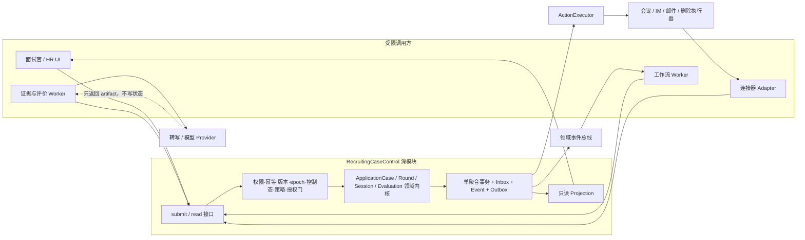

# 招聘 Agent G1a 工程开工包

> 版本：v0.1  
> 日期：2026-08-10  
> 产品边界：已结束的单轮面试 → 证据处理 → 评价草稿 → 面试官确认 → 人类轮次决定 → 归档  
> 当前发布结论：**真实数据、A0/A1、外部写入仍为 No-go**；本包只证明产品逻辑已转成工程可讨论、可校验、可追踪的输入。

## 1. 结论先行

G1a 不应实现成“转写服务 + 报告服务 + 发卡片脚本”的串联。真正需要先造的是一个有唯一写入口的招聘案件控制面：所有 UI、Worker、模型和连接器只提交意图；控制面统一执行权限、版本、幂等、生命周期、暂停/删除、策略、引用一致性和同意校验，再原子写入状态、事件与 Outbox。

工程上的第一条纵切不是接真实会议平台，而是用合成数据跑通：

> `RegisterCompletedSessionFact → ImportCompletedInterview → Evidence → Evaluation → Human Confirmation → Human Decision → Immutable Round Archive`

只有这条纵切能同时证明“可信证据”和“不会越权动作”，才值得向前扩到邮箱、筛选、约面和催办。

## 2. 交付边界

### 2.1 G1a 本包包含

- 一个申请案件下、一个面试轮次中的已结束面试会话受控导入。
- 媒体/人工笔记绑定、授权重验、转写、说话人质量和证据版本。
- 使用案件钉住的画像/评分卡生成结构化评价草稿。
- 关键结论 100% 证据引用、禁用特征/代理变量与提示注入校验。
- 唯一确认责任人、人工修改、确认和独立的人类轮次决定。
- 轮次不可变归档、提醒、异常包、暂停/恢复、人工接管、删除血缘。
- 命令、事件、动作执行、读投影、审计、指标与证据位。

### 2.2 明确不包含

- G1b：多轮依赖、跨轮冲突、终面评估包和 `FINAL_ASSESSMENT_READY` 生成。
- G2：简历收件/解析/路由、画像筛选、部门推送/决定、约面/改期/取消、面前追问。
- 自动录用、自动淘汰、自动推进、自动拒绝信、自动修改画像。
- 真实供应商、数据库、云区域、身份系统或前端框架选型；这些没有当前证据。

## 3. 接口三案对照

### 3.1 方案 A：能力型接口

```text
importInterview()
registerTranscript()
publishEvaluation()
confirmEvaluation()
recordDecision()
archiveRound()
```

优点是类型直观；缺点是每加一个阶段就扩公开接口，调用方会依赖内部顺序，甚至把“确认后自动决定”写进客户端。接口表面小方法很多，Depth 低，改动 Locality 差。

### 3.2 方案 B：一键工作流接口

```text
startPostInterviewWorkflow(input) -> workflow_id
resumeWorkflow(workflow_id, human_input)
```

默认路径简单，但一个长工作流同时包住媒体、评价、人工闸门和外部动作；局部重试、并发编辑、撤回同意和删除竞态容易被隐藏成模糊的 `RUNNING/FAILED`。接口很小，却把重要业务语义也藏掉，深度是假象。

### 3.3 方案 C：命令入口 + 只读投影（采用）

```text
submit(CommandEnvelope) -> CommandResult
read(ProjectionRequest) -> CaseProjection
```

调用方只表达意图，不拼领域事件、不写页面状态、不直连外部系统。SDK 便捷函数只负责生成强类型 `CommandEnvelope`。新阶段通常只增加命令/事件类型，通用门、事务和结果语义不变；复杂度集中在一个 Module 内，接口 Leverage 高、变更 Locality 好。

## 4. 目标模块与信任边界



模型位于控制面之外：它可以生成 `draft_ref` 和 `claim_manifest_ref`，不能构造人类决定、发外部消息或直接推进 `InterviewRound`。

## 5. 模块清单

| Module | Interface | 隐藏的 Implementation | 测试表面 |
|---|---|---|---|
| `RecruitingCaseControl` | `submit`、`read` | 通用命令门、路由、事务、事件/Outbox、结果缓存 | 命令输入 → 结果/事件/投影 |
| `G1aDomainKernel` | 控制面内部调用 | Case/Round/Session/Evaluation 不变量与迁移；不暴露 repository | 通过 `submit` 行为测试，不测私有方法 |
| `EvidencePipeline` | 领取 artifact 任务；以结果命令回写 | 转写、说话人、证据抽取、质量信号、版本管理 | artifact → 受限结果命令；Provider 用假 adapter |
| `EvaluationPipeline` | 领取 evidence set；以草稿结果命令回写 | Prompt、模型调用、claim schema、证据/禁用特征校验 | 金标输入 → 结构化 artifact；无工具权限 |
| `ActionExecutor` | 领取已授权 Outbox；记录回执 | 幂等执行、频控、静默时段、重试、对账、补偿 | ActionExecution 状态与外部 mock 回执 |
| `CaseProjection` | 按权限读取案件/轮次/待办/异常 | 事件消费、页面状态推导、SLA/指标 | 事件序列 → 只读页面投影 |
| `PrivacyOrchestrator` | 权利请求/撤回事件与完成回执 | 血缘遍历、停止处理、删除/保留清单 | 请求 → 停止事实 + 完成回执 |

`G1aDomainKernel` 和存储 seam 都是控制面的内部细节；不能为了单元测试把 repository、状态机 setter 或 event append 暴露成公共接口。

## 6. 依赖分类与 Adapter 策略

| 依赖 | 分类 | seam 决策 | 最低两种 Adapter |
|---|---|---|---|
| 状态迁移、证据覆盖计算、页面投影 | In-process | 直接并入深模块，不建 port | 无；纯行为测试 |
| 事务库、Inbox/Outbox、对象存储本地替身 | Local-substitutable | seam 保持内部；测试运行真实本地替身 | 本地测试替身 + 生产实现，不暴露给调用方 |
| 企业身份/权限、策略中心（若跨服务） | Remote but owned | 控制面拥有 port 与判断；网络只是 adapter | in-memory adapter + HTTP/gRPC adapter |
| 会议/录音、IM、邮件 | True external | `ConnectorPort`，所有动作经 `ActionExecution` | deterministic mock + 生产 provider adapter |
| 转写/LLM | True external | `EvidenceProviderPort` / `ModelProviderPort`；只收发 artifact | fake/golden adapter + 生产 provider adapter |
| 时钟、ID、哈希 | In-process | 仅内部可注入，不能成为产品 API | deterministic test implementation + production implementation |

只有一个实现且没有测试替身的“接口”不算真实 seam；不为假想的 ATS、日历或模型供应商预造抽象层。

## 7. 命令接口

机器定义见 [控制契约](contracts/recruiting-agent-g1a-control.schema.json)。所有命令必须携带 `expected_aggregate_version`、`lifecycle_epoch` 和 `idempotency_key`；`actor_context` 由可信网关注入。

| 命令 | 目标聚合 | 允许主体 | 成功事实 / 主要门 |
|---|---|---|---|
| `RegisterCompletedSessionFact` | InterviewSession | Workflow Service | 记录真实结束事实；外部事件/修订去重 |
| `ImportCompletedInterview` | InterviewRound | Workflow Service | PLANNED/READY → EVIDENCE_PROCESSING；评分卡、授权、指纹、会话事实齐全 |
| `RegisterEvidenceArtifact` | InterviewSession | Evidence Service / 授权人工 | 绑定唯一会话；人工上传也不可绕过授权 |
| `RecordTranscriptOutcome` | InterviewSession | Evidence Service | 生成版本化逐字稿或质量拒绝；不覆盖旧版 |
| `RecordEvaluationDraftGenerated` | EvaluationPackage | Evidence Service | 记录证据集合与模型/Prompt/模板版本；决定字段和工具调用为 0 |
| `PublishEvaluationForReview` | InterviewRound | Workflow Service | EVIDENCE_PROCESSING → AWAITING_CONFIRMATION；关键结论覆盖率为 100% |
| `ReviseEvaluation` | EvaluationPackage | Human | 基于当前版本生成新版本、diff、作者和原因 |
| `SubmitEvaluationReview` | EvaluationPackage | Human | 仅确认/请求修改/报告问题；旧版本拒绝 |
| `ReachConfirmationQuorum` | InterviewRound | Workflow Service only | AWAITING_CONFIRMATION → AWAITING_OUTCOME；同一评价版本满足策略 |
| `RecordRoundDecision` | InterviewRound | **Human only** | AWAITING_OUTCOME → COMPLETED；引用当前确认评价，原子形成归档事实 |
| `RequestReminder` | ActionExecution | Workflow Service | 策略、静默时段、次数、ordinal 幂等门 |
| `PauseScope` / `ResumeScope` | 控制范围 | 授权 Human / Policy Service | 租户/岗位/案件三级暂停；恢复带 `resume_token` |
| `ResolveException` | ExceptionBundle | Human | 记录选择，不直接改业务状态；随后重走原迁移门 |
| `RecordParticipantConsentWithdrawal` | Privacy / Session | Privacy Service / Human | 立即使后续处理与未执行外发失效 |
| `RequestDataDeletion` / `CompleteDataDeletion` | PrivacyRequest | Privacy Service | 血缘删除、合法保留清单与回执 |
| `RequestExternalAction` | ActionExecution | Workflow Service only | 服务端加载策略、生成业务幂等键；Model/UI 禁止提交 |
| `RecordExternalActionResult` | ActionExecution | Connector Service only | 回执、失败、取消或待对账；旧修订不得改变当前业务事实 |

### 7.1 命令处理顺序

1. Schema 和已认证主体。
2. 幂等键 + 规范负载 hash。
3. `expected_aggregate_version`。
4. `lifecycle_epoch`。
5. CLOSED、撤回、删除、租户/岗位/案件暂停与熔断。
6. 服务端当前 `ActionPolicySnapshot` 和动作级 A0–A3。
7. 同租户/同案件/引用版本有效。
8. 录制、转写、新用途处理的授权/合法依据仍有效。
9. 决定类命令必须为有权限的 HUMAN。
10. 单一聚合 + command result + domain event + Outbox 原子提交。

### 7.2 统一结果

| 结果 | 权威语义 |
|---|---|
| `APPLIED` | 本地事实已提交；外部效果可能仍在 Outbox |
| `REPLAYED` | 同键同负载，返回首次结果，没有第二次业务效果 |
| `REJECTED` | 没有状态变化；返回结构化错误/异常包引用 |
| `IGNORED_STALE` | 旧外部修订被安全吸收，不覆盖当前事实 |

## 8. 事件、动作与异常

机器定义见 [事件契约](contracts/recruiting-agent-g1a-event.schema.json)。

- 领域事件是已经发生的事实；命名使用过去式，不作为“请执行”的队列消息。
- `AutomationActionRequested` 只是动作意图；只有 `AutomationActionSucceeded + connector receipt` 证明外部效果。
- `ActionExecution` 保存业务幂等键、业务修订、payload hash、策略快照、尝试、回执、取消令牌与对账状态。
- `ExceptionBundle` 必须让处理人无需重新搜上下文：事实、风险、已尝试动作、可选方案、建议、Owner、截止时间和恢复凭证齐全。
- 事件总线禁止携带简历全文、录音、完整逐字稿和候选人联系方式。

### 8.1 新增领域事实

现有领域目录补充 `CompletedInterviewImported`：它只记录 G1a 受控捷径把 Round 从 `PLANNED/READY_TO_SCHEDULE` 带到 `EVIDENCE_PROCESSING`，且必须引用已登记的结束会话和来源 artifact hash。它不伪造 `SCHEDULED`、`IN_PROGRESS` 或邀请事实。

## 9. 工程 Backlog

状态说明：`SPEC-READY` 只表示需求、接口和验收已具备估算基础，不等于已实现；`G0-BLOCKED` 表示缺少 Gate 0 决策或环境；`NOT-STARTED` 表示尚无工程证据。

| ID | 工程故事 / 可检查产物 | R | 依赖 | 当前状态 |
|---|---|---|---|---|
| G1A-001 | 建实现仓库、分支保护、CI；每次变更校验两份 Schema | Tech Lead | 技术栈、代码托管 | G0-BLOCKED |
| G1A-002 | 认证网关注入 actor；租户/部门/岗位/字段级授权 | Backend + Security | 身份系统、角色矩阵 | G0-BLOCKED |
| G1A-003 | 单聚合事务、Inbox、事件存储、Outbox 的 walking skeleton | Workflow Backend | 数据库/运行环境 | G0-BLOCKED |
| G1A-004 | 数据分级、加密、访问日志、secret/PII 扫描 | Security + Backend | 数据地图、基础设施 | G0-BLOCKED |
| G1A-005 | 动作级 A0–A3 策略与服务端策略快照 | Product + Backend | 动作矩阵签字 | SPEC-READY |
| G1A-010 | `submit/read` 网关、Schema 校验和生成 SDK | Workflow Backend | 001/002/003 | SPEC-READY |
| G1A-011 | 规范负载 hash、同键同载重放、同键异载报警 | Workflow Backend | 003/010 | SPEC-READY |
| G1A-012 | 乐观锁、lifecycle epoch、旧修订 `IGNORED_STALE` | Workflow Backend | 003/010 | SPEC-READY |
| G1A-013 | 事务内 aggregate + result + event + Outbox 一致性 | Workflow Backend | 003 | SPEC-READY |
| G1A-014 | RuntimeEnvelope、三级暂停/熔断、取消令牌和执行前重验 | Workflow Backend | 005/013 | SPEC-READY |
| G1A-015 | ExceptionBundle、唯一活动异常、resume token 和恢复门 | Workflow Backend + Full-stack | 010/014 | SPEC-READY |
| G1A-016 | ActionExecutor：授权、频控、重试、回执、对账、补偿 | Integration + Backend | 005/013/014 | SPEC-READY |
| G1A-017 | Case/Round/Runtime 只读投影与事件时间线 | Full-stack + Backend | 013 | SPEC-READY |
| G1A-020 | 已结束 Session 事实登记与 `ImportCompletedInterview` 受控捷径 | Workflow Backend | 010–014 | SPEC-READY |
| G1A-021 | artifact 唯一绑定、来源指纹、人工上传 provenance | Backend + Integration | 020/004 | SPEC-READY |
| G1A-022 | 逐参与人/逐目的授权快照、晚加入/撤回/无录制路线 | Privacy + Backend | 数据地图、授权方案 | G0-BLOCKED |
| G1A-023 | 媒体对象存储、完整性、字段级访问和保留类别 | Backend + Security | 区域/存储/期限 | G0-BLOCKED |
| G1A-024 | 转写 Port、版本化片段、时间戳、质量信号与有限重试 | AI/Data | 主入口/模型区域 | G0-BLOCKED |
| G1A-025 | 说话人低置信阻断与人工映射任务 | AI/Data + Full-stack | 024 | SPEC-READY |
| G1A-026 | EvidencePointer、证据单元版本和旧版不可覆盖 | AI/Data + Backend | 024/025 | SPEC-READY |
| G1A-030 | 案件画像、Round 评分卡、Prompt/模板的 VersionPin | Workflow Backend | 020 | SPEC-READY |
| G1A-031 | Model Port、受限输出、逐字稿提示注入隔离、零工具权限 | AI/Data + Security | 模型区域/供应商 | G0-BLOCKED |
| G1A-032 | 事实/判断/存疑/信息不足 claim schema；决定字段结构禁用 | AI/Data + Backend | 030/031 | SPEC-READY |
| G1A-033 | 关键 claim 证据覆盖、说话人/案件/版本一致性发布门 | AI/Data + QA | 026/032 | SPEC-READY |
| G1A-034 | 禁用特征与代理变量检测、阻断、合规复核任务 | AI/Data + Privacy | 禁用清单/审计方案 | G0-BLOCKED |
| G1A-035 | 草稿版本、校验清单与 `PublishEvaluationForReview` | Workflow Backend | 030–034 | SPEC-READY |
| G1A-040 | 唯一确认人待办、安全深链、最小信息外发 | Full-stack + Integration | 主确认入口 | G0-BLOCKED |
| G1A-041 | 评价工作台：证据定位、低置信提示、问题反馈 | Full-stack + Design | 026/035 | SPEC-READY |
| G1A-042 | 人工修改版本、diff/作者/原因、并发冲突 | Full-stack + Backend | 035/041 | SPEC-READY |
| G1A-043 | review policy、唯一确认责任与当前版本 quorum | Workflow Backend | 040/042 | SPEC-READY |
| G1A-044 | 独立的人类轮次决定区；无默认预选、权限快照 | Full-stack + Backend | 002/043 | SPEC-READY |
| G1A-045 | Round 原子完成与不可变归档 manifest | Workflow Backend | 026/043/044 | SPEC-READY |
| G1A-050 | Timer generation、静默时段、次数上限、提醒 ordinal 幂等 | Workflow Backend + Integration | 005/016/040 | SPEC-READY |
| G1A-051 | 人工接管范围、恢复点、不中重复外发 | Workflow Backend + Full-stack | 014–016 | SPEC-READY |
| G1A-052 | 撤回/删除血缘、停止生成分发、回执与合法保留清单 | Privacy + Backend | 数据地图/022/023 | G0-BLOCKED |
| G1A-053 | 案件级审计、SLA、质量、动作、异常、成本事件 | Data + Backend | 013/016 | SPEC-READY |
| G1A-054 | 隔离抽检、证据错误分类、岗位/语言/设备/群体分层 | QA + AI/Data + Privacy | 金标/公平方案 | G0-BLOCKED |
| G1A-060 | 合成 fixture、19 命令/24 事件 Schema 契约测试 | QA/SDET | 001/010 | SPEC-READY |
| G1A-061 | AT-001..015 自动化/可重复验收与失败证据 | QA/SDET | 对应纵切 | SPEC-READY |
| G1A-062 | 合法历史样本离线回放、金标、P0 红队、成本基线 | QA + AI/Data | 样本批准/标注规范 | G0-BLOCKED |
| G1A-063 | A0 影子：真实新录音但零业务外发 | Product + QA + Ops | 062 过门 | G0-BLOCKED |
| G1A-064 | A1 小范围建议、暂停/接管/删除/回滚实演与多方签字 | Product + QA + Ops | 063 过门 | G0-BLOCKED |

### 9.1 关键路径

```text
Gate 0 决策与环境
  → 001–005 基础控制
  → 010–017 唯一写入口/事件/动作/投影
  → 020–026 受控导入与证据链
  → 030–035 评价与发布门
  → 040–045 人工确认/决定/归档
  → 050–054 运行与权利保障
  → 060–062 离线证据门
  → 063 A0
  → 064 A1
```

暂停、撤回、删除、审计与异常不是上线后的“补能力”；它们必须在 A0/A1 之前进入关键路径。

## 10. 团队与分工

### 10.1 建议核心 Pod

| 角色 | 建议投入 | 核心所有权 |
|---|---:|---|
| Product Lead | 1 | 终局、切片、门槛、Backlog、动作级放权 |
| Recruiting Ops Owner | 1 | 真实流程、责任人/SLA、评分卡、试点采用 |
| Tech Lead / Architect | 1 | 控制面、事务/事件、非功能门、技术决策 |
| Workflow Backend | 2 | 命令内核、聚合、Outbox、异常、动作执行 |
| Full-stack / Product Engineer | 1 | 确认工作台、控制塔投影、人工接管 |
| AI/Data Engineer | 1 | 转写、证据、评价、校验、指标与成本 |
| QA/SDET | 1 | 契约/状态/竞态/红队/回放证据 |
| Integration Engineer | 0.5–1 | 会议、IM/邮件、回执与对账 Adapter |
| Product Designer | 0.5 | 人工闸门、证据可读性、异常处理 |
| Privacy/Legal + Security | 各 0.2–0.5 | 授权、数据地图、权利请求、公平与发布签字 |
| Executive Sponsor / Pilot Hiring Owner | 固定周审 | 岗位、资源、业务 SLA 与发布承担 |

低于“产品 + 招聘运营 + Tech Lead + 2 Backend + Full-stack + AI/Data + QA”的核心配置，只能做原型或礼宾式验证，不能诚实承诺 8 周生产闭环。

### 10.2 RACI

| 工作流 | Product | Ops | Tech Lead | Backend | Full-stack | AI/Data | QA | Privacy/Security | Sponsor |
|---|---|---|---|---|---|---|---|---|---|
| G1a 范围与成功门 | A/R | R | C | C | C | C | C | C | I |
| 领域/控制面/契约 | C | C | A | R | C | C | C | C | I |
| 证据与评价质量 | A | C | C | C | C | R | R | C | I |
| 确认/决定体验 | A | R | C | C | R | C | C | C | I |
| 连接器与运行可靠性 | C | C | A | R | C | C | R | C | I |
| 隐私、公平、安全闸门 | C | C | C | R | C | C | R | A/R | I |
| Gate 0 / A0 / A1 发布 | R | R | C | C | C | C | R | R | A |

## 11. 条件式首两周领取清单

以下从“人员到位、技术栈/身份/环境拍板”之日计，不是当前已开始的工程排期。

### 第 1 周：控制面 walking skeleton

- Tech Lead：冻结实现 ADR、聚合存储/事务边界、运行环境和生成 SDK 方法。
- Backend：实现 `submit/read`、Schema 校验、内存或本地替身上的 Inbox/Outbox、幂等与乐观锁。
- QA：建立合法命令、同键重放、同键异载、版本冲突、旧 epoch 五类契约测试。
- Product + Ops：冻结唯一确认责任、轮次决定枚举、异常 Owner 与 SLA 口径。
- Privacy/Security：完成 G1a 数据地图 v1、授权凭证字段、访问矩阵和无录制等价路线。
- 周末证据：合成命令可产生唯一事件与投影；无连接器、无真实数据、无模型调用。

### 第 2 周：合成纵切与危险分支

- Backend：实现 Session 结束事实、受控导入、Round 迁移、暂停/取消令牌、异常包。
- AI/Data：先用 deterministic fake adapter 产出受限 transcript/evaluation artifact，不接生产模型。
- Full-stack：实现只读控制塔与“待确认”最小工作台壳，所有写操作走命令入口。
- Integration：实现 mock ActionExecutor，验证成功丢响应、重复回调、取消竞态和对账。
- QA：把原型的重复/乱序、确认≠决定、暂停/恢复、撤回/删除转成接口行为测试。
- 周末证据：合成路径能到 `AWAITING_CONFIRMATION`；旧版本、旧 epoch、缺授权、暂停、无证据结论全部被控制面拒绝。

## 12. Definition of Ready / Done

### 12.1 Story Ready

- 业务对象、命令/事件、Actor、前置状态和禁止状态明确。
- 正常、重放、乱序、暂停/撤回/删除、权限失败场景明确。
- 数据分级、保留与日志内容明确；真实样本有批准依据。
- 依赖系统、Owner、测试 Adapter 和证据 ID 明确。
- 没有依赖“前端隐藏按钮”或“Prompt 里提醒模型别做”的安全假设。

### 12.2 Story Done

- 实现、行为测试、契约测试、权限测试和遥测一起合并。
- 幂等/版本/epoch/控制态在执行点重验，不只在入口检查。
- 失败生成结构化错误或 ExceptionBundle，不静默吞错。
- 事件、动作回执、审计与成本可以回到案件级。
- 需求追踪矩阵中的证据链接可打开；QA 与业务 Owner 验收。
- 涉及真实数据/外发的故事还必须通过对应动作的放权门。

### 12.3 G1a 产品 Done

沿用 PRD 的严格口径：FR-001..032、AT-001..015、合法真实样本离线/A0/A1、P0 红队、分层质量、暂停/接管/删除实演、案件级指标成本和跨职能签字缺一不可。本文档、Schema 或合成原型都不能单独证明 G1a 完成。

## 13. 当前进度与证据

| 层级 | 状态 | 权威证据 | 还不能证明什么 |
|---|---|---|---|
| 产品终局与阶段路线 | 已成稿 | `招聘Agent产品落地总方案.md` | 不是客户/团队签字 |
| G1a PRD | 已成稿 | `招聘Agent_G1_MVP_PRD.md` | 32 FR 尚无实现 |
| 领域/事件/ADR | 已成稿 | `招聘Agent_领域与事件规格.md`、`docs/adr/` | 尚无持久化/并发验证 |
| 控制塔逻辑 | 合成验证通过 | `招聘Agent控制塔_原型验收记录.md`：63/63 | 浏览器原型不是后端安全边界 |
| 工程接口契约 | v0.1 已形成 | `contracts/*.schema.json` | 尚未由实现仓库消费 |
| Backlog/分工/追踪 | v0.1 已形成 | 本文 + `招聘Agent_G1a_需求追踪矩阵.md` | 尚未完成人员领取/估算 |
| 真实工程实现 | 未开始/无证据 | 当前工作区无代码仓库、CI、部署、测试运行 | 不能声称任何 FR 已实现 |
| Gate 0 | No-go | `招聘Agent_Gate0执行包.md`、`招聘Agent推进看板.md` | 不能使用真实数据或外发 |

## 14. Gate 0 仍需拍板

1. Sponsor、1–2 个试点岗位、Recruiting Ops Owner 和业务 SLA 承诺。
2. 一个主录音入口、人工上传兜底和一个主确认入口。
3. 技术栈、代码仓库、身份/权限、数据库、对象存储、运行区和日志平台。
4. 录制/转写/评价的逐目的告知与可证明授权、无录制等价路线、保留期限和数据地图。
5. 30 场现状基线、合法样本审批、金标与 P0 红队集、质量/公平分层门槛。
6. 模型/转写供应商的数据区域、不训练、留存、删除和跨境结论。
7. 确认人规则、提醒静默时段/上限、异常升级链和动作级 A0–A3。

这些不是文档润色项，而是让 Backlog 从 `G0-BLOCKED` 进入真正 `READY` 的输入门。

## 15. 验证记录

结构检查、覆盖计数、链接验证、已知验证缺口与 SHA-256 记录在 [G1a 工程开工包验收记录](./招聘Agent_G1a_工程开工包验收记录.md)。完整 JSON Schema 2020-12 正反 fixture 验证仍是实现仓库的 G1A-001/G1A-060 门，不能由本地结构 lint 替代。
